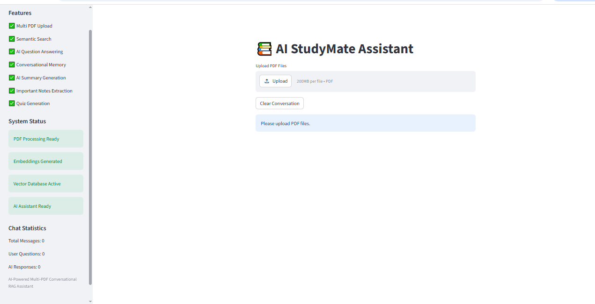
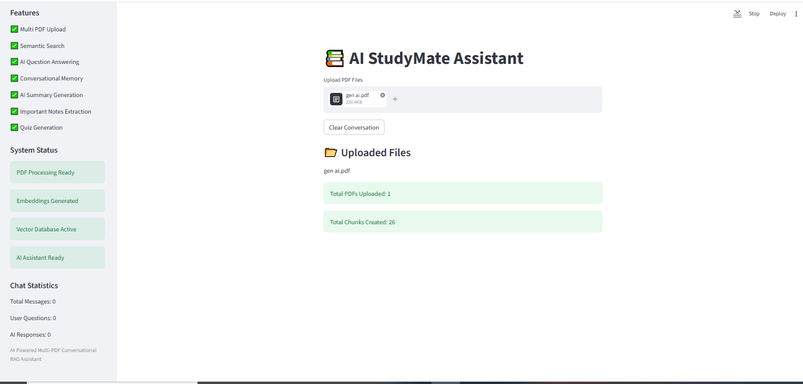
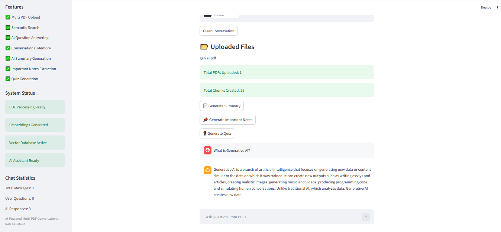
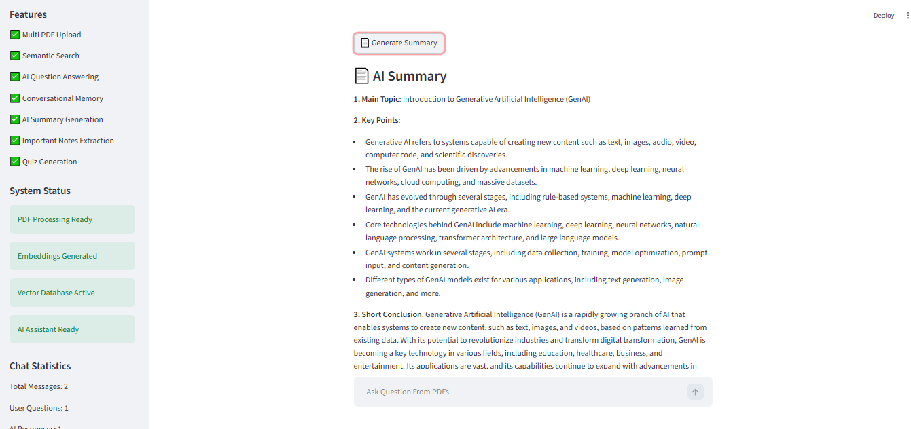
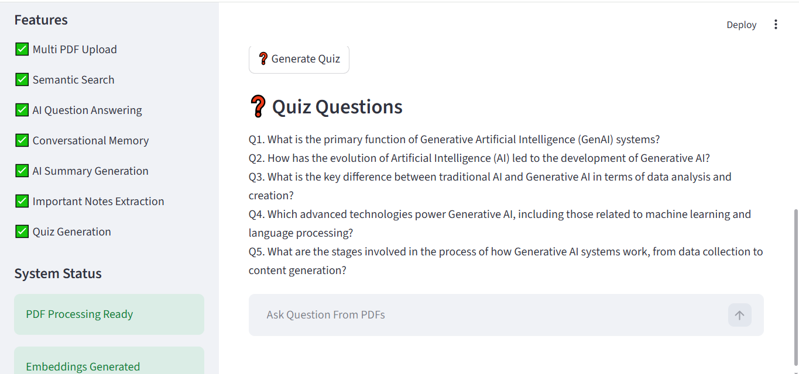

# 📚 AI StudyMate Assistant

## Overview

AI StudyMate Assistant is an AI-powered educational document intelligence system developed using Streamlit, LangChain, Groq LLM, FAISS, and Sentence Transformers.

The application enables students to upload one or more PDF documents and interact with them through an intelligent conversational interface. The system uses Retrieval-Augmented Generation (RAG) to provide context-aware answers, generate summaries, extract important notes, and create quizzes from uploaded study materials.

---

## Project Objective

Students often spend significant time reading lengthy educational documents, preparing notes, identifying key concepts, and revising important topics.

The objective of this project is to simplify the learning process by leveraging Generative AI and Retrieval-Augmented Generation (RAG) techniques to provide instant access to relevant information from study materials.

---

## Technologies Used

- Python
- Streamlit
- LangChain
- Groq API
- Llama 3.3 70B Versatile
- FAISS Vector Database
- Sentence Transformers
- PyPDF
- NumPy
- Python Dotenv

---

## AI Concepts Implemented

- Generative AI
- Large Language Models (LLMs)
- Retrieval-Augmented Generation (RAG)
- Semantic Search
- Vector Embeddings
- Vector Databases
- Prompt Engineering
- Conversational AI
- Context-Aware Retrieval

---

## System Architecture

                        AI StudyMate Assistant
┌─────────────────────────────────────────────────────────────┐
│                         User Interface                      │
│                     (Streamlit Application)                │
└───────────────────────┬─────────────────────────────────────┘
                        │
                        ▼
┌─────────────────────────────────────────────────────────────┐
│                     Multi PDF Upload                        │
└───────────────────────┬─────────────────────────────────────┘
                        │
                        ▼
┌─────────────────────────────────────────────────────────────┐
│                  PDF Text Extraction                        │
│                         (PyPDF)                             │
└───────────────────────┬─────────────────────────────────────┘
                        │
                        ▼
┌─────────────────────────────────────────────────────────────┐
│                    Text Chunking                            │
│          RecursiveCharacterTextSplitter                     │
└───────────────────────┬─────────────────────────────────────┘
                        │
                        ▼
┌─────────────────────────────────────────────────────────────┐
│                 Embedding Generation                        │
│           Sentence Transformers (MiniLM)                   │
└───────────────────────┬─────────────────────────────────────┘
                        │
                        ▼
┌─────────────────────────────────────────────────────────────┐
│                  FAISS Vector Database                      │
│               Vector Storage & Indexing                     │
└───────────────────────┬─────────────────────────────────────┘
                        │
                        ▼
┌─────────────────────────────────────────────────────────────┐
│                    Semantic Retrieval                       │
│            Similar Chunks Retrieved Using FAISS             │
└───────────────────────┬─────────────────────────────────────┘
                        │
                        ▼
┌─────────────────────────────────────────────────────────────┐
│                    Prompt Construction                      │
│     Context + User Query + Conversation History             │
└───────────────────────┬─────────────────────────────────────┘
                        │
                        ▼
┌─────────────────────────────────────────────────────────────┐
│                   Groq LLM (Llama 3.3)                      │
│               AI-Powered Response Generation                │
└───────────────────────┬─────────────────────────────────────┘
                        │
                        ▼
┌─────────────────────────────────────────────────────────────┐
│                      Final Output                           │
│  Question Answering | Summary | Notes | Quiz Generation     │
└─────────────────────────────────────────────────────────────┘

---

## Project Workflow

Step 1: PDF Upload

Users upload one or more educational PDF documents through the Streamlit interface.

Step 2: Text Extraction

PyPDF extracts text from the uploaded PDF documents.

Step 3: Text Chunking

Large documents are divided into smaller chunks using RecursiveCharacterTextSplitter.

Step 4: Embedding Generation

Sentence Transformers convert text chunks into numerical vector embeddings.

Step 5: Vector Storage

Embeddings are stored inside a FAISS vector database.

Step 6: Semantic Retrieval

Relevant chunks are retrieved based on the user's question using similarity search.

Step 7: Response Generation

Retrieved context and user query are sent to the Groq LLM.

Step 8: Final Output

The AI generates accurate and context-aware responses for the user.

---

## Features

### Document Intelligence

- Multi PDF Upload
- PDF Text Extraction
- Text Chunking
- Embedding Generation
- Semantic Search
- Vector-Based Retrieval

### AI Assistant Features

- Conversational Question Answering
- Context-Aware Responses
- Conversational Memory
- Intelligent Document Understanding

### Learning Assistance Features

- AI Summary Generation
- Important Notes Extraction
- Quiz Generation
- Study Material Analysis

### User Interface Features

- Streamlit Web Application
- Chat Statistics Dashboard
- Interactive Chat Interface
- Real-Time Responses

---

## Project Structure

AI-StudyMate-Assistant/
│
├── documents/
│   └── sample.pdf
│
├── screenshots/
│   ├── homepage.png
│   ├── pdf_upload.png
│   ├── question_answering.png
│   ├── summary_generation.png
│   └── quiz_generation.png
│
├── .env
├── app.py
├── embeddings.py
├── pdf_extraction.py
├── retrieval.py
├── text_splitters.py
├── vector_store.py
├── requirements.txt
└── README.md

---

# Application Screenshots

## Home Page

---

## PDF Upload

---

## Question Answering

---

## Summary Generation

---

## Quiz Generation

---

## Module Description

### app.py

Main Streamlit application containing:

- User Interface
- PDF Upload
- Summary Generation
- Notes Extraction
- Quiz Generation
- Conversational AI Chat

### pdf_extraction.py

Handles PDF reading and text extraction.

### text_splitters.py

Splits extracted text into manageable chunks.

### embeddings.py

Generates vector embeddings using Sentence Transformers.

### vector_store.py

Creates and manages FAISS vector storage.

### retrieval.py

Performs semantic retrieval using similarity search.

---

## Installation

### Clone Repository

git clone https://github.com/Abiinayashree/AI-StudyMate-Assistant.git

### Navigate to Project Folder

cd AI-StudyMate-Assistant

### Install Dependencies

pip install -r requirements.txt

Configure Environment Variables

### Create a ".env" file:

GROQ_API_KEY=your_api_key_here

### Run Application

streamlit run app.py

---

## Requirements

### Software Requirements

- Python 3.10+
- Visual Studio Code
- Git
- GitHub Account
- Groq API Key

### Python Libraries

- streamlit
- langchain
- langchain-text-splitters
- langchain-groq
- pypdf
- sentence-transformers
- faiss-cpu
- numpy
- python-dotenv

---

## Sample Use Cases

### Question Answering

Users can ask questions directly from uploaded study materials.

### AI Summary Generation

Generate concise summaries from lengthy educational documents.

### Important Notes Extraction

Automatically identify key concepts and exam-relevant notes.

### Quiz Generation

Generate practice questions for revision and self-assessment.

---

## Learning Outcomes

Through this project, the following concepts were implemented and understood:

- Retrieval-Augmented Generation (RAG)
- Semantic Search
- Vector Databases
- Embedding Models
- LLM Integration
- Prompt Engineering
- Streamlit Application Development
- AI-Powered Educational Systems

---

## Future Enhancements

- PDF Download for Notes
- PDF Download for Summary
- MCQ Quiz with Answers
- Voice-Based Interaction
- Multi-Language Support
- Cloud Deployment
- User Authentication
- Learning Progress Tracking
- Advanced Analytics Dashboard

---

## Project Status

✅ Successfully Developed

✅ Successfully Tested

✅ Functional RAG Workflow Implemented

✅ AI-Powered Educational Assistant Completed

---

## Author

Abinayashree M

Postgraduate Student (MCA)

Generative AI Enthusiast

Interested in:

- Generative AI
- Large Language Models (LLMs)
- Retrieval-Augmented Generation (RAG)
- AI-Powered Educational Applications
- Intelligent Assistants